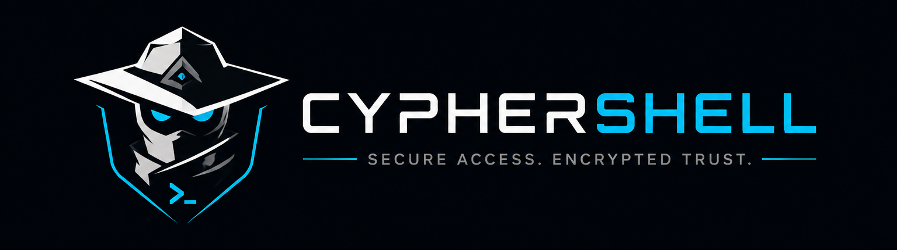

<p align="center">
  
</p>

<h1 align="center">CypherShell</h1>

<p align="center">
  <strong>A polished, secure, cross-platform SSH desktop client built with Electron, React, and TypeScript.</strong><br/>
  A powerful GUI alternative to PuTTY and MobaXterm — with built-in SFTP, SSH key management, port forwarding, and AES-256 encryption at rest.
</p>

<p align="center">
  <a href="https://github.com/athul-ts/CypherShell/releases"></a>
  <a href="LICENSE"></a>
  <a href="https://github.com/athul-ts/CypherShell/stargazers"></a>
  <a href="https://github.com/athul-ts/CypherShell/issues"></a>
  
  
</p>

---

## Table of Contents

- [Why CypherShell?](#-why-cyphershell)
- [Screenshots](#-screenshots)
- [Features](#-features)
- [Tech Stack](#-tech-stack)
- [Architecture](#-architecture)
- [Getting Started](#-getting-started)
- [Building for Production](#-building-for-production)
- [Project Structure](#-project-structure)
- [Security](#-security)
- [Contributing](#-contributing)
- [Roadmap](#-roadmap)
- [Troubleshooting](#-troubleshooting)
- [License](#-license)
- [Author](#-author)

---

## 🤔 Why CypherShell?

Most SSH clients are either too simple (PuTTY), too heavyweight (MobaXterm), require cloud accounts (Termius), or are expensive (SecureCRT). CypherShell aims to be the **open-source, privacy-first, fully offline** alternative that doesn't compromise on features or polish.

| Feature                          | CypherShell |    PuTTY    |  MobaXterm  | Termius  |
| -------------------------------- | :---------: | :---------: | :---------: | :------: |
| Cross-platform (Win/Mac/Linux)   |     ✅      | ⚠️ Win only | ⚠️ Win only |    ✅    |
| Built-in SFTP file manager       |     ✅      |     ❌      |     ✅      |    ✅    |
| SSH key generation & management  |     ✅      | ⚠️ PuTTYgen |     ✅      |    ✅    |
| Port forwarding UI               |     ✅      |  ⚠️ Manual  |     ✅      |    ✅    |
| Encrypted credential storage     | ✅ AES-256  |     ❌      |     ❌      | ✅ Cloud |
| Fully offline / no cloud account |     ✅      |     ✅      |     ✅      |    ❌    |
| Audit / activity logs            |     ✅      |     ❌      |     ❌      |    ❌    |
| Real-time transfer progress      |   ✅ SSE    |     ❌      |     ✅      |    ✅    |
| Open source                      |   ✅ MIT    |   ✅ MIT    |     ❌      |    ❌    |
| Modern UI                        |     ✅      |     ❌      |     ⚠️      |    ✅    |

---

## 📸 Screenshots

> Screenshots will be added as the project reaches its first public release. Place them in `docs/screenshots/` and update the paths below.

<!--
<p align="center">
  
  <br/><em>Home Dashboard — manage profiles, keys, and logs in one place</em>
</p>

<p align="center">
  
  <br/><em>Terminal — xterm.js with 6 curated themes and full keyboard support</em>
</p>

<p align="center">
  
  <br/><em>SFTP — dual-pane file manager with real-time transfer progress</em>
</p>

<p align="center">
  
  <br/><em>SSH Key Manager — generate, import, and securely store keypairs</em>
</p>
-->

---

## ✨ Features

### 🖥️ Terminal Sessions

- Full-featured SSH terminal powered by **xterm.js** with complete ANSI/color support
- Spawn **independent windows** per session — work across multiple monitors
- Keyboard support: `Ctrl+C`, `Ctrl+Z`, `Tab`, arrow keys, function keys, `Ctrl+F` search
- PTY resize follows the window — no fixed geometry
- Auto-reconnect with exponential backoff (up to 3 retries)
- Connection status indicator (connected / reconnecting / disconnected)

### 📁 SFTP File Manager

- Dual-pane interface (local ↔ remote) in a standalone window
- Browse, upload, download, rename, delete, and `chmod` remote files
- **Real-time transfer progress** streamed via Server-Sent Events (SSE) — zero polling
- Drag-and-drop upload and download
- Transfer queue with active, completed, and failed items; one-click retry on failure
- Toggle visibility of dotfiles
- Breadcrumb path navigation

### 🔑 SSH Key Manager

- Generate **RSA** (2048 / 4096-bit) and **ED25519** keypairs in-app
- Import keys in **PEM**, **OpenSSH**, and **PuTTY PPK** formats
- All private keys stored as **AES-256-GCM** encrypted blobs — never in plaintext
- Optional per-key passphrase protection
- SHA-256 fingerprint display
- Copy public key to clipboard or export to file

### 🚇 Port Forwarding

- **Local forwarding:** `localhost:localPort → remoteHost:remotePort`
- **Remote forwarding:** `remoteHost:remotePort → localhost:localPort`
- **Dynamic SOCKS5 proxy** support
- Start, stop, and monitor tunnels directly from the profile tab
- Port conflict detection before binding

### 🗂️ Connection Profiles

- Save SSH settings: host, port, username, auth method (password / key / key+passphrase)
- Group profiles with custom tags (e.g., "Production", "Staging", "Dev")
- One-click profile duplication
- Real-time search and tag filtering
- Last-connected timestamp displayed per profile

### 🔒 App Lock & Master Password

- Optional master password protects all stored credentials
- First-run setup wizard for configuring lock settings
- Encryption keys derived via **PBKDF2-SHA512** (200,000 iterations) — key held in memory only, never written to disk
- Master password hashed with **bcrypt (cost 12)**
- Configurable auto-lock after inactivity (default: 15 minutes)

### 📋 Audit Logs

- Every connection, upload, and download logged with timestamp, duration, and status
- Search by keyword and filter by date range
- Export logs as **CSV** for compliance or review
- Configurable retention period (default: 90 days), with automatic purge

### 🎨 Themes & Customization

- Light, Dark, and System theme modes
- 6 curated terminal color themes: **Default Dark**, **Dracula**, **Nord**, **Solarized Dark**, **Monokai**, **One Dark**
- Customizable terminal font (default: JetBrains Mono) and font size

### 🔄 Auto-Updater

- Checks for new releases silently in the background
- Notifies you when an update is ready; installs on next launch

---

## 🛠️ Tech Stack

| Layer                       | Technology                                               |
| --------------------------- | -------------------------------------------------------- |
| **Shell / Packaging**       | Electron 39, electron-builder 26                         |
| **Frontend Framework**      | React 19, React Router 7                                 |
| **Language**                | TypeScript 5.9 (all layers)                              |
| **Build Tool**              | electron-vite 5 (Vite 6 under the hood)                  |
| **Styling**                 | Tailwind CSS 3.4 + shadcn/ui (Radix primitives)          |
| **Terminal Emulator**       | xterm.js 6 (+ fit, search, web-links addons)             |
| **State Management**        | Zustand 5                                                |
| **Data Fetching / Caching** | TanStack Query v5                                        |
| **HTTP Client**             | Axios 1.16                                               |
| **Icons**                   | Lucide React                                             |
| **Backend Framework**       | Express 4                                                |
| **Database**                | SQLite via Prisma ORM + better-sqlite3                   |
| **SSH Protocol**            | ssh2 (sessions), ssh2-sftp-client (file transfer)        |
| **Real-time I/O**           | WebSocket (terminal), Server-Sent Events (SFTP progress) |
| **Cryptography**            | Node.js `crypto` (AES-256-GCM, PBKDF2), bcrypt           |
| **Key Generation**          | node-forge (RSA/ED25519), sshpk (PPK conversion)         |
| **Authentication**          | JSON Web Tokens (jsonwebtoken)                           |
| **Validation**              | Zod                                                      |

---

## 🏗️ Architecture

CypherShell uses a **three-process Electron architecture** where the backend is a real Express server spawned as a child process, not a bundled Node module. This keeps security boundaries clean and makes the backend independently testable.

```
┌──────────────────────────────────────────────────────────────────┐
│  Electron Main Process                                           │
│  ─────────────────────────────────────────────────────────────   │
│  • Finds a free localhost port (portfinder)                      │
│  • Sets DATABASE_URL env variable                                │
│  • Spawns Express backend as child process                       │
│  • Creates BrowserWindow (React renderer)                        │
│  • Passes backend port to preload via contextBridge              │
│  • Handles: window lifecycle, IPC, file dialogs, auto-updater    │
└──────────────────┬───────────────────────────────────────────────┘
                   │  IPC (contextBridge)
                   ▼
┌──────────────────────────────────────────────────────────────────┐
│  Renderer Process — React SPA                                    │
│  ─────────────────────────────────────────────────────────────   │
│  • Reads window.api.backendPort from preload                     │
│  • Axios REST calls (JWT interceptor) for profiles, keys, logs   │
│  • WebSocket for bidirectional SSH terminal I/O                  │
│  • EventSource (SSE) for real-time SFTP transfer progress        │
│  • Zustand for client-side state (sessions, tabs, transfers)     │
└──────────────────┬───────────────────────────────────────────────┘
                   │  HTTP / WebSocket / SSE  (127.0.0.1 only)
                   ▼
┌──────────────────────────────────────────────────────────────────┐
│  Express Backend — Node.js child process                         │
│  ─────────────────────────────────────────────────────────────   │
│  • SQLite + Prisma ORM (WAL mode)                                │
│  • SSH session pool  Map<sessionId, ssh2.Client>                 │
│  • WebSocket server — terminal input/output bridge               │
│  • SSE endpoints — SFTP transfer progress streaming              │
│  • CryptoService — AES-256-GCM encrypt/decrypt                   │
│  • JWT authentication + rate limiting middleware                  │
└──────────────────────────────────────────────────────────────────┘
```

**Key data flows:**

- **SSH Terminal:** `xterm.js keystroke → WebSocket → ssh2 stream → remote server → WebSocket → xterm.js render`
- **SFTP Upload:** `file select → multipart POST → ssh2-sftp-client stream → SSE progress events → Zustand → progress bar`
- **Authentication:** `master password → bcrypt verify → PBKDF2-SHA512 derive AES key → held in-memory → encrypt/decrypt on all DB reads/writes`

---

## 🚀 Getting Started

### Prerequisites

- **Node.js** 20 or later — [nodejs.org](https://nodejs.org)
- **npm** 9 or later (bundled with Node.js)
- **Git**

On Linux you may also need build tools for native modules:

```bash
sudo apt-get install build-essential python3
```

### 1. Clone the Repository

```bash
git clone https://github.com/athul-ts/CypherShell.git
cd CypherShell
```

### 2. Install Dependencies

```bash
# Frontend / Electron
npm install

# Backend
cd backend
npm install
npx prisma migrate dev --name init
cd ..
```

### 3. Start in Development Mode

```bash
npm run dev
```

The Electron app launches with **hot-reload** for the renderer. The Express backend starts automatically on an ephemeral local port found by portfinder. The SQLite database is created in your OS user-data directory on first run.

### Available Scripts

| Command                  | Description                                 |
| ------------------------ | ------------------------------------------- |
| `npm run dev`            | Start Electron with hot-reload (HMR)        |
| `npm run build`          | Compile TypeScript + Vite bundles           |
| `npm run typecheck`      | Full TypeScript check across all targets    |
| `npm run lint`           | Run ESLint                                  |
| `npm run format`         | Auto-format with Prettier                   |
| `npm run build:backend`  | Compile backend TypeScript only             |
| `npm run rebuild:native` | Rebuild native modules against Electron ABI |
| `npm run build:win`      | Package Windows installer                   |
| `npm run build:mac`      | Package macOS DMG                           |
| `npm run build:linux`    | Package Linux AppImage + deb                |

---

## 📦 Building for Production

| Platform    | Command               | Output                           |
| ----------- | --------------------- | -------------------------------- |
| **Windows** | `npm run build:win`   | `dist/*.exe` (NSIS installer)    |
| **macOS**   | `npm run build:mac`   | `dist/*.dmg`                     |
| **Linux**   | `npm run build:linux` | `dist/*.AppImage` + `dist/*.deb` |

All artifacts are written to the `dist/` directory.

> **Note:** Native modules (`better-sqlite3`, `ssh2`) are automatically rebuilt against the target Electron ABI by the `after-pack` hook and are excluded from the asar archive for correct loading at runtime.

> **macOS code signing:** Set the `CSC_LINK` and `CSC_KEY_PASSWORD` environment variables before building if you want a signed `.dmg`. Unsigned builds will trigger Gatekeeper warnings on first launch.

---

## 📁 Project Structure

```
CypherShell/
├── src/
│   ├── main/
│   │   └── index.ts               # Electron main: window mgmt, IPC, backend spawn
│   ├── preload/
│   │   └── index.ts               # contextBridge → window.api (safe IPC surface)
│   └── renderer/src/
│       ├── pages/                 # Home, LockScreen, SetupWizard, Settings, Keys, Logs
│       ├── components/
│       │   ├── terminal/          # TerminalPane, TabBar, TunnelModal
│       │   ├── sftp/              # SftpPane, LocalFilePane, TransferQueue
│       │   ├── profiles/          # ProfileDetailPane, ProfileForm, ProfileCard
│       │   ├── keys/              # KeyList, KeyGenerator, KeyImport
│       │   ├── layout/            # Sidebar, TitleBar, StatusBar
│       │   └── ui/                # shadcn/ui base components
│       ├── hooks/                 # Custom React hooks (useSFTPTransfer, etc.)
│       ├── store/                 # Zustand stores (sessions, tabs, transfers, themes)
│       ├── lib/                   # api.ts (Axios), terminalThemes, utils
│       └── types/                 # Shared TypeScript interfaces
│
├── backend/
│   ├── src/
│   │   ├── index.ts               # Express bootstrap, route registration
│   │   ├── routes/                # auth, profile, sftp, session, key, tunnel, audit
│   │   ├── controllers/           # Request handlers
│   │   ├── services/              # ssh, sftp, crypto, tunnel, audit, key, config
│   │   ├── middleware/            # auth (JWT), rateLimit
│   │   ├── websocket/             # terminal.ws (xterm ↔ ssh2 bridge)
│   │   └── config/                # db.ts (Prisma init + WAL mode), env.ts
│   └── prisma/
│       ├── schema.prisma          # DB schema (Profile, SSHKey, Tunnel, AuditLog, AppConfig)
│       └── migrations/            # Auto-generated Prisma migrations
│
├── build/                         # electron-builder resources (icons, installer scripts)
├── resources/                     # App icon assets (icns, ico, png)
├── scripts/                       # Build helpers (rebuild-native, after-pack)
├── docs/                          # Documentation and screenshots
├── electron-builder.yml           # Packaging config for Win / Mac / Linux
├── electron.vite.config.ts        # Vite config (main + preload + renderer targets)
├── tailwind.config.js
└── tsconfig.json
```

---

## 🔐 Security

CypherShell is designed with **defense-in-depth** — sensitive material is protected at every layer.

| What                         | How                                                                      |
| ---------------------------- | ------------------------------------------------------------------------ |
| SSH passwords & private keys | **AES-256-GCM** encrypted before storage in SQLite                       |
| Master password              | **bcrypt** (cost factor 12) — never stored in plaintext                  |
| Encryption key derivation    | **PBKDF2-SHA512**, 200,000 iterations; derived key held in-memory only   |
| Key material in renderer     | Private keys are **never** sent to the renderer process                  |
| Backend network binding      | Express binds to **`127.0.0.1`** only — not reachable externally         |
| API authentication           | **JWT** tokens, 8-hour expiration, required on every endpoint            |
| Rate limiting                | 5 auth attempts / min · 300 API requests / min                           |
| Auto-lock                    | Configurable inactivity timeout clears the in-memory AES key             |
| SFTP path traversal          | Backend validates all remote paths before operating                      |
| Context isolation            | Electron `contextIsolation: true`; renderer has no direct Node.js access |

**Reporting a vulnerability:** Please open a [GitHub Security Advisory](https://github.com/athul-ts/CypherShell/security/advisories/new) rather than a public issue. We aim to respond within 72 hours.

---

## 🤝 Contributing

Contributions of all kinds are welcome — bug fixes, new features, documentation improvements, and UI polish.

### 1. Fork & Clone

```bash
git clone https://github.com/<your-username>/CypherShell.git
cd CypherShell
```

### 2. Create a Branch

```bash
git checkout -b feat/your-feature-name
# or
git checkout -b fix/issue-description
```

### 3. Make Your Changes

- Follow the existing TypeScript coding style.
- Run `npm run lint` and `npm run typecheck` before committing.
- Run `npm run format` to keep formatting consistent.
- For backend changes, run `cd backend && npm run build` to verify compilation.

### 4. Commit with a Descriptive Message

We follow [Conventional Commits](https://www.conventionalcommits.org/):

```
feat: add SFTP file search
fix: correct PTY resize on Linux
docs: update contributing guide
refactor: extract crypto helpers into service
```

### 5. Open a Pull Request

Push to your fork and open a PR against the `main` branch. Please include:

- **What** the change does and **why**
- Steps to test it manually
- Screenshots for UI changes

> For major features or breaking changes, please open an [issue](https://github.com/athul-ts/CypherShell/issues) first to discuss the approach before investing time in implementation.

### Code Style

| Tool       | Command             |
| ---------- | ------------------- |
| Lint       | `npm run lint`      |
| Format     | `npm run format`    |
| Type-check | `npm run typecheck` |

---

## 🗺️ Roadmap

The following features are planned or under consideration. Contributions toward any of these are especially welcome.

- [ ] **SSH Agent forwarding** — forward local SSH agent to remote sessions
- [ ] **Jump host / bastion support** — multi-hop SSH via ProxyJump
- [ ] **Session recording & playback** — record terminal sessions as asciicast
- [ ] **Snippet manager** — store and quickly insert frequently used commands
- [ ] **Synchronized input** — send keystrokes to multiple sessions simultaneously
- [ ] **Workspace layouts** — save and restore multi-window arrangements
- [ ] **TOTP / 2FA support** — keyboard-interactive authentication with TOTP prompts
- [ ] **Plugin system** — extend functionality via community plugins
- [ ] **Mobile app** (long-term) — React Native companion for quick access

Have an idea not listed here? [Open a feature request](https://github.com/athul-ts/CypherShell/issues/new?labels=enhancement).

---

## 🧯 Troubleshooting

### `better-sqlite3` fails to load after cloning

Native modules must be compiled against the Electron ABI, not the system Node.js ABI.

```bash
npm run rebuild:native
```

### Backend port conflict on startup

The backend uses `portfinder` to automatically select a free port starting from 4000. If you see a port error in the logs, another process may be holding all ports in the searched range. Check `app.log` in your OS user-data directory for the exact error.

### Prisma migration errors on first run

Delete the SQLite database file and re-run migrations:

```bash
# Database is at:
# Windows: %APPDATA%\CypherShell\sshclient.db
# macOS:   ~/Library/Application Support/CypherShell/sshclient.db
# Linux:   ~/.config/CypherShell/sshclient.db
```

Then run:

```bash
cd backend
npx prisma migrate dev --name init
```

### App log location

Diagnostic logs are written to:

| OS      | Path                                                |
| ------- | --------------------------------------------------- |
| Windows | `%APPDATA%\CypherShell\app.log`                     |
| macOS   | `~/Library/Application Support/CypherShell/app.log` |
| Linux   | `~/.config/CypherShell/app.log`                     |

### White screen on launch (macOS)

This is usually a Gatekeeper issue with an unsigned build. Right-click the `.app` bundle and choose **Open**, then confirm. Alternatively, build from source to avoid this.

---

## 📄 License

This project is licensed under the **MIT License** — see the [LICENSE](LICENSE) file for details.

You are free to use, modify, and distribute CypherShell for any purpose, including commercial use. Attribution is appreciated but not required.

---

## 👤 Author

**Athul T S**

- GitHub: [@athul-ts](https://github.com/athul-ts)
- Website: [cyphershell.in](https://cyphershell.in)
- Email: athul.ts@inciem.com

---

<p align="center">
  <sub>If CypherShell saves you time, consider giving it a ⭐ on GitHub — it helps others discover the project.</sub>
</p>
